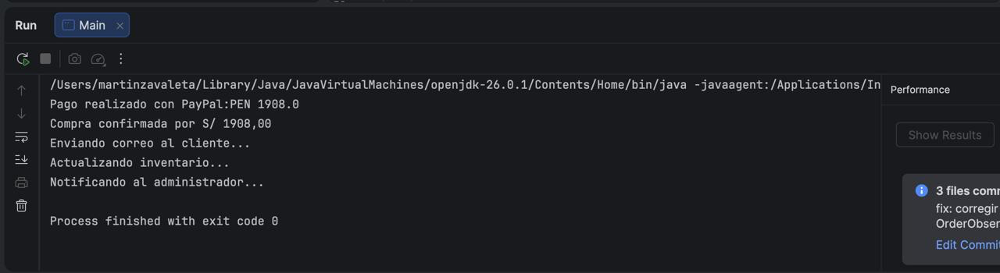

# Tienda Virtual - Patrones de Diseño
Zavaleta Rodriguez, Martin Alonso

1. Descripcion de problema abordado

El proyecto consiste en desarrollar 
una tienda virtual funcional desde consola.
El sistema debe permitir:
- Registrar productos
- Agregar productos a un carrito de compras
- Aplicar estrategias de descuento
- Procesar pago usando adapter 
- Notificar al confirmar la compra

Para lograr la implementacion de las funcionalidades
solicitadas se utilizaron tres patrones de diseño de 
software:
- Strategy para abordar las estregias de descuento
- Adapter para abordar el proceso de pago
- Observer para el flujo de notificaciones

2. Explicacion de patrones aplicados

- **Strategy**: Se aplicó a la lógica de descuentos 
  para permitir que el carrito cambie dinámicamente 
  entre no aplicar descuento, descuento porcentual 
  o descuento de monto fijo sin alterar su código
  interno.

  Clases e interfaces vinculadas:*DiscountStrategy(I),FixedAmountDiscountStrategy(C),
  PercentageDiscountStrategy(C),NoDiscountStrategy(C)*
  

- **Adapter**: Se utilizó para integrar un servicio de pago
  externo incompatible (PayPal), adaptándolo a la interfaz
  estándar PaymentProcessor que usa la tienda.

  Clases e interfaces vinculadas:*PaymentProcessor(I),PayPalAdapter(C),
  ExternalPayPalService(C)*

- **Observer**: Se implementó para el flujo de notificaciones.
  El servicio de órdenes notifica automáticamente al cliente (correo),
  al inventario y al administrador cada vez que se confirma una compra.
  
  Clases e interfaces vinculadas:*OrderService(C),OrderObserver(I), 
  AdminNotificactionObserver(C),EmailNotificationObserver(C),
  InventoryObserver(C)*
3. Captura de salida 

